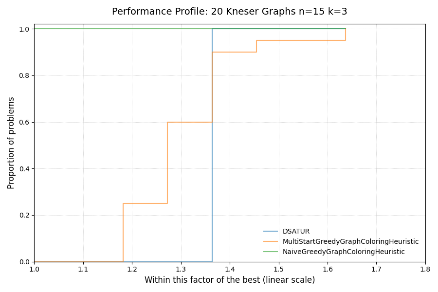
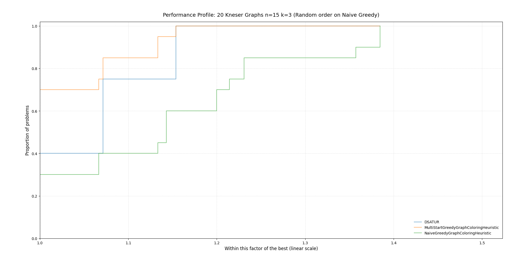
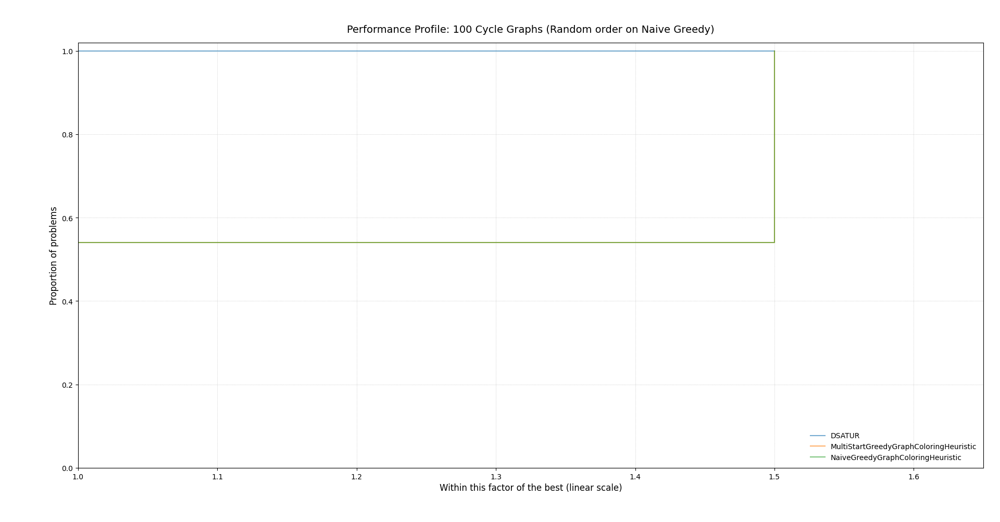
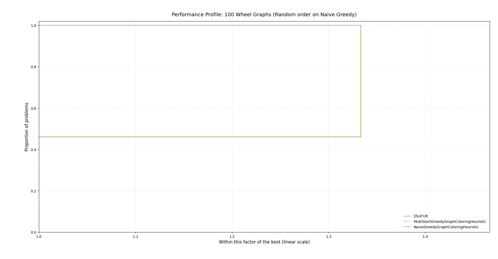
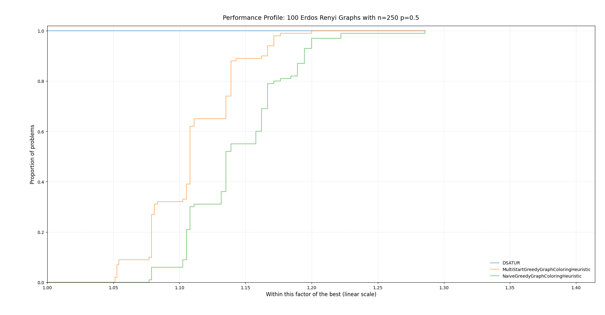
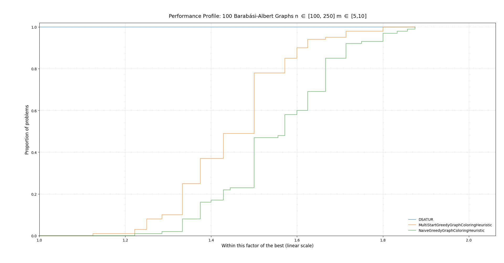

# Benchmarks of the solvers and heuristics

## Heuristics
We ran the heuristics on several different instance sets. Here are the results:

### Kneser Graphs
When looking at the following performance profile one could suspect that the Naive Greedy is the best heuristic for this type of graph classes. On second look it is quite curious that the multistart greedy heuristic performs worse than only the naive greedy algorithm. This is caused by the naive greedy algorithm using the order of nodes provided by `networkx`. In future work we should investigate why this results in the best coloring of the used methods.

If the naive greedy algorithm uses random order it performs, as suspected worse results than the multistart greedy.

### Cycle Graphs & Wheel Graphs

For cycle graphs DSATUR performs better than both versions of the greedy. This is not suprising, as Dsatur is optimal for cycle graphs.

The same goes for wheel graphs.

### Erdős-Rényi-Graphs

For Erdős-Rényi-Graphs Dsatur performs better on all instances than both Greedy versions.

### Barabási-Albert-Graphs
As seen before Dsatur performs better; in comparison to the performance on Erdős-Rényi-Graphs the performance difference is even greater.
