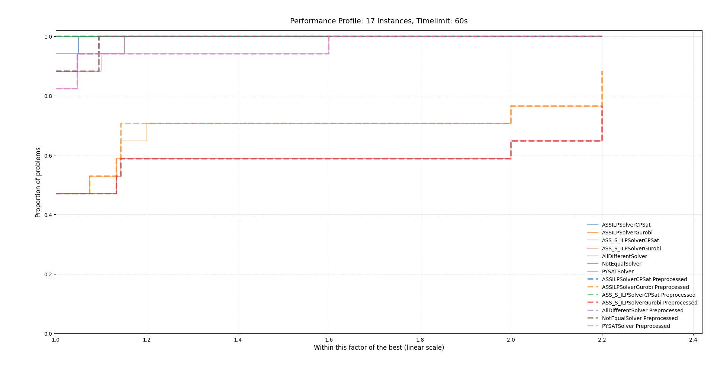
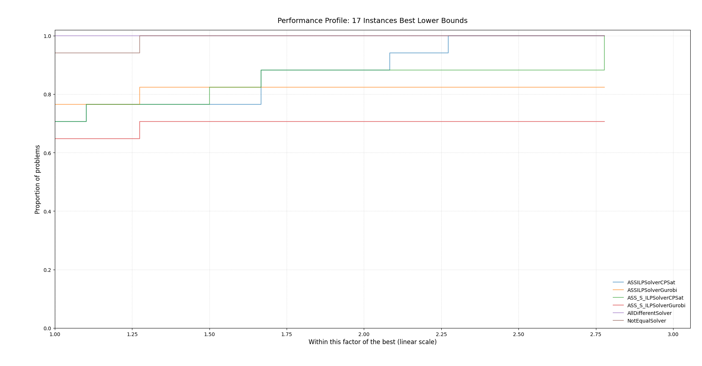
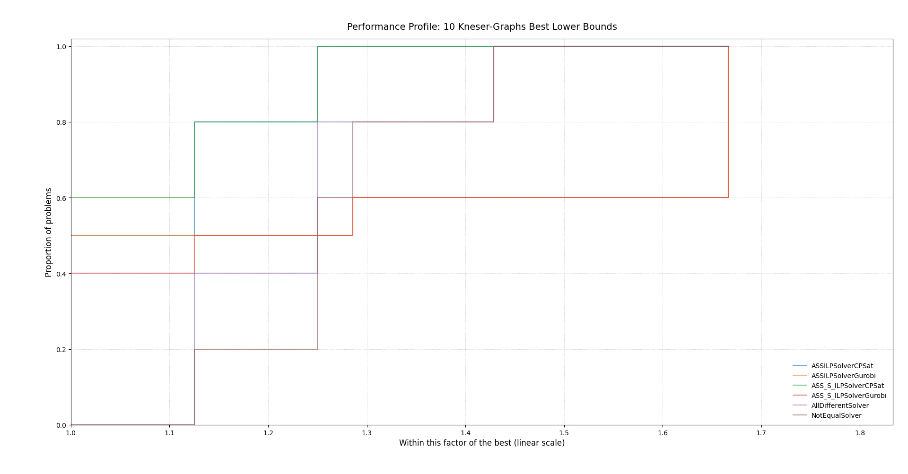
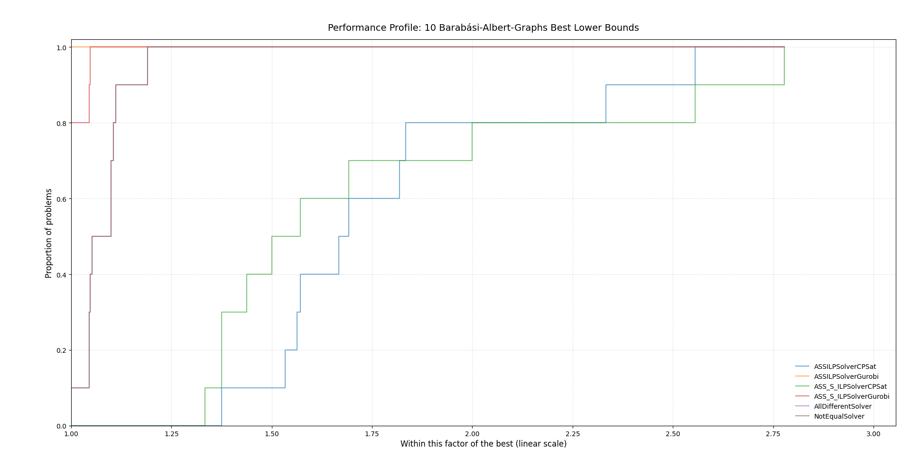

# Benchmarks of the solvers and heuristics

## Heuristics
We ran the heuristics on several different instance sets. Here are the results:

### Kneser Graphs
When looking at the following performance profile one could suspect that the Naive Greedy is the best heuristic for this type of graph classes. On second look it is quite curious that the multistart greedy heuristic performs worse than only the naive greedy algorithm. This is caused by the naive greedy algorithm using the order of nodes provided by `networkx`. In future work we should investigate why this results in the best coloring of the used methods.


If the naive greedy algorithm uses random order it performs, as suspected, worse results than the multistart greedy.


### Cycle Graphs & Wheel Graphs

For cycle graphs DSATUR performs better than both versions of the greedy. This is not suprising, as Dsatur is optimal for cycle graphs.


The same goes for wheel graphs.


### Erdős-Rényi-Graphs

For Erdős-Rényi-Graphs Dsatur performs better on all instances than both Greedy versions.


### Barabási-Albert-Graphs
As seen before Dsatur performs better; in comparison to the performance on Erdős-Rényi-Graphs the performance difference is even greater.


## Solvers

For benchmarking the solvers we chose a subset of the instances from [this](https://mat.tepper.cmu.edu/COLOR/instances.html) website of the CMU. 
Consisting of the following instances:

```["jean.col", "huck.col", "zeroin.i.1.col", "fpsol2.i.1.col", "fpsol2.i.2.col", "fpsol2.i.3.col", "le450_15b.col", "le450_15c.col", "le450_15d.col", "le450_25a.col", "le450_25b.col", "le450_25c.col", "le450_25d.col", "le450_5a.col", "le450_5b.col", "le450_5c.col", "le450_5d.col"]```

As the instances vary in size and difficulty to solve, we quickly ran into an issue concerning the solvers scaling. Most of the models sizes are dependent on an upper bound to the problem, which fixed the issue for all solvers except for the two representative based solvers.
The Gurobi and CPSat representative based formulation does not use an upper bound. Therefore, the models can not be reduced in size by a better heuristic. 
For many instances this leads to an out of memory error. Where, as a result, the current process is killed. This lead to many issues while benchmarking because the error can not easily be handled with Pythons try-except-structure. In future work, this could be done be creating a subprocess on every solve; or using a machine with more memory.

Running the rest of the solvers on the instances with a 60 second time limit and the DSatur heuristic as an upper bound resulted in the following performance profile:



Curiously, the preprocessor did not have a noticable impact. The preprocessor removed about 30% of the nodes on all graphs (see [this](./evaluations/preprocessor/17_instances.txt) file). This brings up the question why the impact is not noticeable. The preprocessor mainly reduced those graphs which could be solved to optimality beforehand. Therefore the impact is not as large. Additionally, the preprocessor only altered 11 out of the 17 instances.

Both Gurobi solvers (ASS and ASS-S) performed worse than any of the other solvers including PYSAT.

Since we do not have access to hardware capable of optimizing large instances the time limit is reduced to 20 seconds to review the solvers abilites to prove lower bounds.





Remarkably not one solver performs best on all graph classes. Though the performance for the best upper bound is roughly the same as the best lower bound. To achieve results which can be interpreted in any way we would need an instance set where the solvers dont solve to optimality. Unfortunately this is not achievable with our current access to hardware and the limitations set by the task (running for 60 seconds).

## Preprocessor

The preprocessor does not really have an effect on the instances retrieved from the CMU. Only 11 out of the 17 graphs were altered at all and thoose graphs which were altered had only about 30% of the edges removed. At face value this might seem like a large number, but most of the removed nodes are from the easier instances (jean 80→12 nodes and huck 74→11 nodes).

The preprocessor performs well on graphs with a large clique and many sparse parts. 
The following code creates a graph in which every node of the original graph has the as many leafs as the original graph had nodes:
```python
def very_leafy_graph(n: int, p: float):
    
    graph: nx.Graph = nx.erdos_renyi_graph(n, p)
    
    original_nodes = list(graph.nodes())
    num_nodes = len(original_nodes)
    
    leaf = num_nodes
    for node in original_nodes:
        for _ in range(num_nodes):
            graph.add_node(leaf)
            graph.add_edge(node, leaf)
            leaf += 1
    
    return graph
```

Following this schema we could create a graph class on which the percentage of removed nodes by the preprocessor approaches 100%. 
